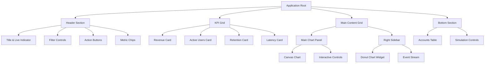
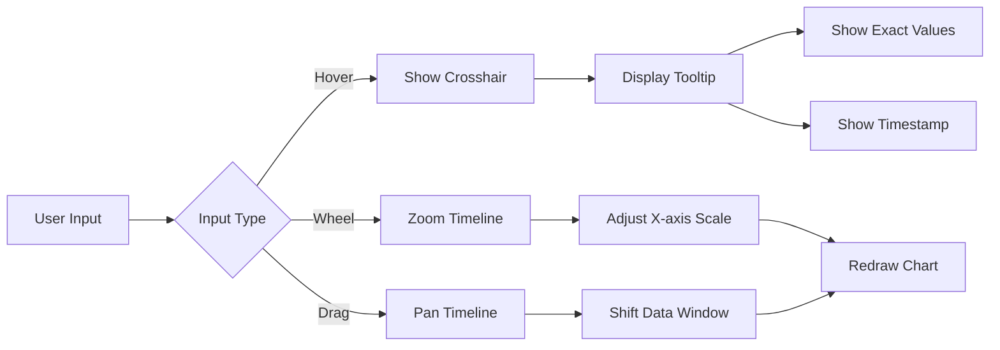
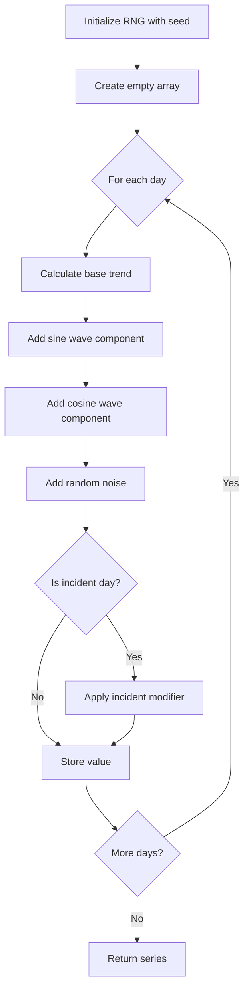
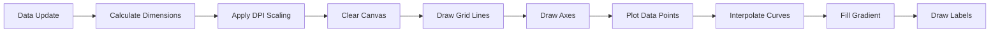
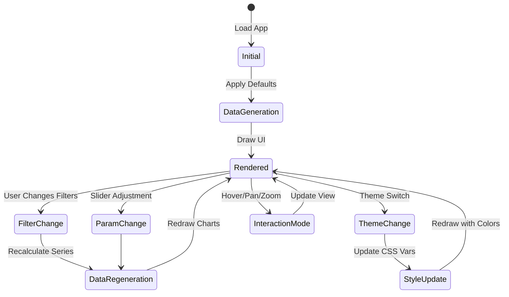

# Mock Interactive Analytics Dashboard - Design Document

## Overview

A single-file, self-contained HTML application that presents a fully interactive analytics dashboard with synthetic data generation. The application demonstrates advanced frontend techniques including custom canvas-based visualizations, glassmorphic UI design, and real-time data simulation without requiring a backend.

## Design Goals

- **Self-Contained Architecture**: Everything (HTML, CSS, JavaScript) in one file with CDN dependencies only
- **Visual Excellence**: Deep space/cyberpunk aesthetic with glassmorphism and smooth animations
- **Custom Visualizations**: All charts rendered using native Canvas API without external charting libraries
- **Interactive Experience**: Real-time updates, hover interactions, pan/zoom capabilities, and dynamic data manipulation
- **Performance**: Optimized for Retina displays with proper DPI scaling and smooth 60fps animations

## Technology Stack

| Component      | Technology                | Source                       |
| -------------- | ------------------------- | ---------------------------- |
| Markup         | HTML5                     | Native                       |
| Styling        | Tailwind CSS v4           | CDN (@tailwindcss/browser@4) |
| Scripting      | Vanilla JavaScript (ES6+) | Native                       |
| Visualizations | HTML5 Canvas API          | Native                       |
| Typography     | System sans-serif fonts   | Native                       |

## Visual Design System

### Color Palette: "Aurora" Theme

| Element             | Color Code             | Usage                             |
| ------------------- | ---------------------- | --------------------------------- |
| Background Dark     | #070A12                | Primary background gradient start |
| Background Light    | #0B1020                | Primary background gradient end   |
| Card Primary        | rgba(255,255,255,0.06) | Glass panel background            |
| Card Secondary      | rgba(255,255,255,0.08) | Elevated glass panels             |
| Stroke              | rgba(255,255,255,0.10) | Borders and dividers              |
| Text Primary        | rgba(255,255,255,0.92) | Main content text                 |
| Text Muted          | rgba(255,255,255,0.72) | Secondary text                    |
| Text Subdued        | rgba(255,255,255,0.55) | Tertiary text                     |
| Revenue Accent      | #60A5FA                | Blue for revenue metrics          |
| Active Users Accent | #34D399                | Emerald for user metrics          |
| Retention Accent    | #A78BFA                | Violet for retention              |
| Warning             | #FBBF24                | Amber for warnings                |
| Error               | #FB7185                | Rose for errors/latency           |

### Glassmorphism Effect

Glass panels utilize the following properties:

- Semi-transparent white background with low opacity
- 1px solid border with subtle white tint
- Backdrop blur filter (10px) for depth
- Layered box shadows (outer shadow + inner highlight)
- Gradient overlay from lighter to darker opacity

### Background Composition

Layered background structure:

1. Base linear gradient (navy to darker navy)
2. Three radial gradient orbs positioned at strategic points
   - Blue orb at top-left (15% horizontal, -10% vertical)
   - Violet orb at top-right (110% horizontal, 10% vertical)
   - Emerald orb at bottom-center (40% horizontal, 110% vertical)
3. CSS grid pattern overlay with radial mask for depth illusion
4. Grid lines sized at 40x40px with subtle white tint

### Animation System

| Animation Type | Purpose                  | Duration       | Easing                   |
| -------------- | ------------------------ | -------------- | ------------------------ |
| Pop-in         | Element entrance         | 420ms          | cubic-bezier(.2,.9,.2,1) |
| Shimmer        | Loading/highlight effect | 2.6s loop      | ease-in-out              |
| Pulse Dot      | Live indicator           | 1.8s loop      | ease-out                 |
| Tooltip Fade   | Hover information        | 120ms          | ease                     |
| Stagger Fade   | Table rows entrance      | 50ms increment | ease                     |

## Application Structure

### Component Hierarchy



## Functional Components

### 1. Header Section

#### Title & Branding

- Application title with gradient logo icon (triangle symbol)
- Subtitle showing status and live indicator
- Pulsing blue dot animated with expanding shadow effect

#### Filter Controls

**Range Selector**

- Three toggle buttons: 7d, 30d, 90d
- Visual state indication for active selection
- Triggers data regeneration on change

**Segment Dropdown**

- Options: All Users, Pro, Free, Enterprise
- Affects data filtering and visualization scope

#### Actions

**Regenerate Button**

- Refreshes synthetic data with new seed
- Maintains current filter and segment selections
- Updates all visualizations simultaneously

**Export CSV Button**

- Downloads current dataset as CSV file
- Includes all visible metrics and time series data
- Formatted with proper headers and timestamp

#### Metric Chips

- Toggle buttons for: Revenue, Active Users, Retention, Latency
- Switches the main chart display to selected metric
- Visual highlighting for active metric

### 2. KPI Grid (Top Row)

Four glass cards displaying primary metrics:

| Card         | Metric                | Format              | Visualization             |
| ------------ | --------------------- | ------------------- | ------------------------- |
| Revenue      | Current revenue value | Currency ($120k)    | Blue area sparkline       |
| Active Users | User count            | Number (5,400)      | Emerald line sparkline    |
| Retention    | Percentage retained   | Percentage (92%)    | Violet area sparkline     |
| Latency      | Response time         | Milliseconds (45ms) | Amber/Rose line sparkline |

#### Card Contents

- Metric name label
- Large formatted current value
- Delta badge showing percentage change (positive/negative)
- Canvas sparkline chart (120x40px area or line chart)
- Smooth interpolated curves using bezier calculations

### 3. Main Chart Section

#### Primary Canvas Chart

**Visual Properties**

- Large canvas element (responsive width, 400px height base)
- Smooth line rendering with bezier curve interpolation
- Gradient fill beneath the line
- Grid lines for y-axis reference
- Axis labels (time on x, value on y)

**Interactive Features**



**Tooltip Behavior**

- Fixed position element following cursor
- Displays date/time at hover point
- Shows exact metric value
- Smooth opacity transition on show/hide

#### Side Widgets

**Anomaly Score**

- Calculated metric based on data volatility
- Formula: Standard deviation of recent data points normalized
- Visual indicator (badge with color based on severity)

**Forecast**

- Linear regression extrapolation for next 7 days
- Simple least-squares method on recent trend
- Displayed as projected value with confidence indicator

**Target Progress**

- Horizontal progress bar
- Compares current metric to hardcoded target
- Color transitions based on completion percentage
- Displays current value / target value

### 4. Real-time Mix & Event Stream

#### Donut Chart (Traffic Sources)

**Data Categories**

- Search (organic/paid)
- Direct (URL entry)
- Social (platforms)
- Referral (external links)

**Visual Implementation**

- Canvas-based arc drawing
- Animated rotation on initial render
- Color-coded segments with legend
- Center displays total count

**Animation Sequence**

1. Start with all arcs at 0 degrees
2. Animate each arc to final angle over 800ms
3. Use easing function for smooth acceleration/deceleration

#### Event Stream

**Event Types**
| Event | Icon/Indicator | Data Shown |
|-------|----------------|------------|
| Checkout | Currency symbol | Transaction amount |
| New User | User icon | User segment |
| API Spike | Alert symbol | Endpoint identifier |
| Error | Warning symbol | Error type |
| Deployment | Rocket icon | Version number |

**Behavior**

- Auto-scrolling list (max 15 visible items)
- New events prepended to top
- Fade-in animation for new entries
- Timestamp for each event (relative time)
- Simulation loop adds event every 2-4 seconds

### 5. Accounts Table

#### Controls

**Search Input**

- Filters table rows by company name
- Real-time filtering (debounced 200ms)
- Case-insensitive matching

**Sort Dropdown**

- Options: Name, Revenue, Active Users, Latency, Health
- Ascending/Descending toggle
- Re-animates rows on sort

#### Table Structure

| Column       | Data Type    | Format                            |
| ------------ | ------------ | --------------------------------- |
| Company Name | String       | Plain text                        |
| Plan         | Enum         | Badge (Free/Pro/Enterprise)       |
| Revenue      | Currency     | $XX,XXX                           |
| Active Users | Number       | X,XXX                             |
| Latency      | Milliseconds | XXXms                             |
| Health       | Enum         | Status badge (Healthy/Watch/Risk) |

**Health Calculation**

- Healthy: Latency < 100ms AND Revenue growth > 0
- Watch: Latency 100-200ms OR flat revenue
- Risk: Latency > 200ms OR negative revenue

**Row Animation**

- Stagger delay: 50ms \* row_index
- Fade-in from opacity 0 to 1
- Slight translate-y movement (10px to 0)

### 6. Simulation Controls

#### Parameter Sliders

**Noise Control**

- Range: 0 to 1
- Default: 0.3
- Effect: Multiplier for random fluctuation in data series
- Visual feedback: Real-time chart update

**Growth Control**

- Range: -0.5 to 0.5
- Default: 0.15
- Effect: Linear trend coefficient (negative = decline, positive = growth)
- Impacts all metrics proportionally

**Incidents Control**

- Range: 0 to 10
- Default: 2
- Effect: Number of simulated anomaly events in time series
- Creates dips in retention, spikes in latency

#### Theme Switcher

**Available Themes**
| Theme | Primary Color | Accent | Background |
|-------|---------------|--------|------------|
| Aurora | Blue (#60A5FA) | Violet | Navy gradient |
| Ember | Orange (#FB923C) | Rose | Dark red gradient |
| Mono | Gray (#9CA3AF) | White | Charcoal gradient |

**Implementation**

- Buttons to select theme
- Updates CSS custom properties on root element
- Triggers chart redraw with new color scheme
- Smooth color transitions via CSS

## Data Generation System

### Synthetic Data Engine

#### Seeded Random Number Generator

Uses Mulberry32 algorithm for deterministic pseudo-randomness:

- Input: 32-bit integer seed
- Output: Float between 0 and 1
- Property: Same seed always produces same sequence
- Seed source: Combination of timestamp and user selections

#### Data Series Generation Function

**Function Signature**

```
genSeries(days, baseValue, growth, noise, incidents, seed)
```

**Parameters**
| Parameter | Type | Description |
|-----------|------|-------------|
| days | Integer | Number of data points to generate |
| baseValue | Number | Starting value for series |
| growth | Float | Daily growth rate coefficient |
| noise | Float | Random fluctuation amplitude |
| incidents | Integer | Number of anomaly events to inject |
| seed | Integer | RNG seed for reproducibility |

**Algorithm Flow**



**Mathematical Model**

Base trend component:

- Linear growth: `baseValue * (1 + growth * dayIndex)`

Cyclical components:

- Weekly pattern: `amplitude * sin(dayIndex * 2π / 7)`
- Monthly pattern: `amplitude * cos(dayIndex * 2π / 30)`

Noise component:

- Random fluctuation: `noise * (random() - 0.5) * baseValue * 0.1`

Incident injection:

- Random day selection for each incident
- Revenue/Active: -15% to -25% dip
- Retention: -10% to -20% drop
- Latency: +50% to +150% spike

### Metric-Specific Characteristics

**Revenue**

- Base value: $80,000 - $120,000
- Typical growth: 0.1 to 0.2 (10-20% monthly)
- Weekly cycles: Higher on weekdays
- Incident impact: Moderate negative spikes

**Active Users**

- Base value: 3,000 - 8,000 users
- Typical growth: 0.05 to 0.15
- Weekly cycles: Higher on weekdays, dip on weekends
- Incident impact: Minimal (users don't disappear instantly)

**Retention**

- Base value: 85% - 95%
- Typical growth: -0.02 to 0.05 (slowly improves or degrades)
- Monthly cycles: Dips at month-end
- Incident impact: Significant drops during outages

**Latency**

- Base value: 35ms - 60ms
- Typical growth: -0.01 to 0.03 (optimization vs. scale)
- No strong cycles
- Incident impact: Major spikes (3x-5x normal)

## Canvas Visualization Implementation

### Rendering Pipeline



### DPI Scaling Strategy

To ensure sharp rendering on high-DPI displays:

1. Detect `window.devicePixelRatio`
2. Set canvas internal resolution: `width * devicePixelRatio`
3. Set canvas CSS size to logical pixels
4. Scale drawing context: `ctx.scale(devicePixelRatio, devicePixelRatio)`
5. All drawing operations use logical coordinates

### Smooth Curve Interpolation

Instead of straight lines between points, use cubic bezier curves:

**Control Point Calculation**

- For each data point, calculate slope to neighbors
- Control points placed at 1/3 distance to next point
- Angle determined by average slope
- Creates smooth transitions without overshooting

**Drawing Sequence**

1. Move to first data point
2. For each subsequent point:
   - Calculate control points from previous and current point
   - Draw bezier curve using `ctx.bezierCurveTo()`
3. Close path for area fill

### Gradient Fill

**Linear Gradient Setup**

- Start point: Top of chart area
- End point: Bottom of chart area
- Color stops:
  - 0%: Metric accent color at 60% opacity
  - 50%: Metric accent color at 30% opacity
  - 100%: Transparent

**Application**

- Fill closed path under the curve
- Draw stroke over fill for crisp line

### Sparkline Charts

Simplified version of main chart:

- Smaller canvas (120x40px logical size)
- No axes or labels
- Single color scheme
- No interactivity
- Auto-scales to data range
- Area fill under curve

### Donut Chart Drawing

**Arc Calculation**

- Convert data percentages to radians
- Start angle: -90° (top of circle)
- Each segment: `percentage * 2π` radians

**Drawing Process**

1. Calculate center point of canvas
2. Define outer radius and inner radius (donut hole)
3. For each data category:
   - Begin path
   - Arc from currentAngle to currentAngle + segmentAngle
   - Set fillStyle to category color
   - Fill arc segment
   - Update currentAngle
4. Draw center circle (white/transparent for hole effect)

**Animation**

- Animate segments growing from 0 to full angle
- Use requestAnimationFrame for smooth 60fps
- Duration: 800ms with easing function
- Stagger each segment by 100ms

## Utility Functions

### Formatting Helpers

**Currency Formatter**

- Input: Number
- Output: String
- Logic:
  - < 1,000: "$XXX"
  - < 1,000,000: "$X.Xk"
  - ≥ 1,000,000: "$X.Xm"
  - Rounds to 1 decimal place

**Number Formatter**

- Input: Number
- Output: String
- Logic:
  - < 1,000: "XXX"
  - < 1,000,000: "X.Xk"
  - ≥ 1,000,000: "X.Xm"

**Percentage Formatter**

- Input: Decimal (0-1)
- Output: String
- Format: "XX%" or "XX.X%" based on precision needed

**Delta Formatter**

- Input: Current value, previous value
- Output: String with sign and color indicator
- Format: "+X.X%" or "-X.X%"
- Color: Green for positive, red for negative

**Time Formatter**

- Input: Date object or timestamp
- Output: String
- Formats:
  - For axis labels: "MMM DD" (Jan 15)
  - For tooltips: "MMM DD, HH:mm" (Jan 15, 14:30)
  - For events: Relative time (2m ago, 5h ago, 3d ago)

### Interaction Handlers

**Hover Tracking**

- Listen to mousemove on canvas
- Calculate mouse position relative to canvas
- Map x-coordinate to data point index
- Map y-coordinate to value scale
- Update tooltip content and position
- Show crosshair at mouse location

**Pan Implementation**

- Listen to mousedown, mousemove, mouseup
- Track drag distance
- Convert pixel offset to data offset
- Update visible data window
- Redraw chart with new window

**Zoom Implementation**

- Listen to wheel event
- Prevent default page scroll
- Determine zoom direction (in/out)
- Calculate new zoom level (limit to 1x - 10x)
- Adjust visible data window
- Maintain center point at mouse position
- Redraw chart

### Export Functionality

**CSV Generation**

- Construct header row with column names
- Iterate through data points
- Format each row: timestamp, metric values
- Join with commas, rows with newlines
- Create Blob with text/csv MIME type
- Generate download link and trigger click
- Filename: "analytics-export-{timestamp}.csv"

## Responsive Design

### Breakpoint Strategy

| Breakpoint | Width          | Layout Changes                      |
| ---------- | -------------- | ----------------------------------- |
| Mobile     | < 640px        | Single column, stacked components   |
| Tablet     | 640px - 1024px | Two column grid, condensed header   |
| Desktop    | > 1024px       | Full grid layout, expanded controls |

### Canvas Resize Handling

On window resize:

1. Debounce resize events (150ms delay)
2. Recalculate canvas dimensions based on container
3. Clear and redraw all canvases
4. Maintain zoom/pan state if applicable
5. Adjust font sizes and spacing proportionally

### Touch Support

For mobile/tablet devices:

- Replace hover with tap for tooltips
- Pinch gesture for zoom on charts
- Swipe gesture for pan
- Larger touch targets for buttons (min 44x44px)

## Performance Considerations

### Optimization Strategies

**Canvas Rendering**

- Only redraw when data changes or interaction occurs
- Use requestAnimationFrame for smooth animations
- Batch canvas operations to minimize state changes
- Cache static elements (grid, axes) on separate layer if needed

**Data Processing**

- Generate data once, cache in memory
- Only recalculate on parameter change
- Use efficient array methods (map, reduce, filter)
- Avoid nested loops where possible

**Event Handling**

- Debounce rapid events (resize, search input)
- Throttle high-frequency events (mousemove) to ~60fps
- Use passive event listeners for scroll/wheel where appropriate
- Remove event listeners on component cleanup

**Animation Performance**

- Use CSS transforms for animations (GPU accelerated)
- Limit simultaneous animations
- Respect prefers-reduced-motion media query
- Cancel ongoing animations before starting new ones

### Memory Management

- Clear canvas contexts when not in use
- Remove event listeners when elements unmounted
- Limit event log to maximum number of entries (50)
- Prune old data points when zoomed/panned beyond range

## Accessibility Considerations

### Keyboard Navigation

- All interactive elements focusable via Tab
- Focus ring styling visible and high contrast
- Enter/Space activates buttons
- Arrow keys navigate between metric chips
- Escape closes tooltips/modals

### Screen Reader Support

- Semantic HTML structure (header, main, section)
- ARIA labels for icon buttons
- ARIA live regions for dynamic updates (event stream)
- Table headers properly associated with data cells
- Canvas fallback: Provide data table alternative or ARIA label with current metric value

### Visual Accessibility

- High contrast text (WCAG AA minimum)
- No color-only indicators (always pair with icon/text)
- Animations can be disabled via prefers-reduced-motion
- Focus states clearly visible
- Minimum touch target sizes met

## State Management

### Application State

Global state object structure:

- currentMetric: String (revenue | active | retention | latency)
- range: Integer (7 | 30 | 90)
- segment: String (all | pro | free | enterprise)
- seed: Integer (current RNG seed)
- zoomLevel: Number (1-10)
- panOffset: Integer (data points offset)
- noise: Number (0-1)
- growth: Number (-0.5 to 0.5)
- incidents: Integer (0-10)
- theme: String (aurora | ember | mono)

### State Updates



### Persistence

No backend persistence required, but consider:

- Save state to localStorage on change
- Restore state on page load
- Allow URL query parameters to set initial state
- Example: `?range=30&metric=revenue&theme=ember&seed=12345`

## Theme System Implementation

### CSS Custom Properties

Define all theme colors as CSS variables in `:root`:

- --bg0, --bg1: Background gradients
- --card, --card2: Glass panel backgrounds
- --stroke: Border color
- --muted, --muted2: Text colors
- --good, --warn, --bad: Status colors
- --accent, --accent2: Primary accent colors

### Theme Switching

When user selects new theme:

1. Update CSS variables via JavaScript
2. Trigger redraw of all canvas elements with new colors
3. CSS transitions handle color changes for HTML/CSS elements
4. Save theme preference to localStorage

### Theme Definitions

**Aurora Theme** (Default)

- Accent: Blue/Violet
- Background: Navy
- Mood: Cool, professional

**Ember Theme**

- Accent: Orange/Rose
- Background: Dark red/burgundy
- Mood: Warm, energetic

**Mono Theme**

- Accent: Gray/White
- Background: Charcoal
- Mood: Minimal, focused

## Event Simulation Logic

### Event Generator

Runs on interval (2000ms - 4000ms random):

1. Select random event type from pool
2. Generate appropriate data for event type
3. Prepend to event log array
4. Remove oldest event if log exceeds 50 items
5. Render new event with fade-in animation

### Event Type Definitions

**Checkout Event**

- Amount: Random between $10 - $500
- Payment method: Random (Card, PayPal, etc.)
- Display: "Checkout • $XX.XX"

**New User Event**

- Segment: Random (Free, Pro, Enterprise)
- Display: "New User • [Segment]"

**API Spike Event**

- Endpoint: Random from list (/api/users, /api/orders, etc.)
- Display: "API Spike • [Endpoint]"

**Error Event**

- Error type: Random (500, 404, Timeout, etc.)
- Display: "Error • [Type]"

**Deployment Event**

- Version: Incremental (v1.2.3, v1.2.4, etc.)
- Display: "Deployment • [Version]"

## Edge Cases & Error Handling

### Data Validation

- Ensure generated values never go negative (clamp to 0)
- Handle division by zero in percentage calculations
- Validate user input ranges on sliders

### Canvas Errors

- Check canvas context availability before drawing
- Handle canvas size of 0 (hidden elements)
- Graceful degradation if backdrop-filter unsupported

### Browser Compatibility

- Provide fallback if CSS backdrop-filter not supported
- Use feature detection for Canvas API
- Ensure ES6 features available or provide polyfills

### User Input

- Sanitize search input (prevent XSS even though no backend)
- Validate numeric inputs stay within bounds
- Debounce rapid input changes- Validate numeric inputs stay within bounds
